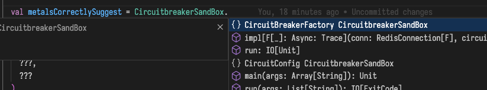

# importing objects from the main file to the test file

 when running

 ```bash
 ❯ scala-cli test CircuitbreakerSandBoxSuite.test.scala
Compiling project (test, Scala 2.13.12, JVM (17))
[error] ./CircuitbreakerSandBoxSuite.test.scala:27:8
[error] not found: object CircuitbreakerSandBox
[error] import CircuitbreakerSandBox._
[error]        ^^^^^^^^^^^^^^^^^^^^^
[error] ./CircuitbreakerSandBoxSuite.test.scala:28:8
[error] not found: object CircuitbreakerSandBox
[error] import CircuitbreakerSandBox.CircuitBreakerFactory
[error]        ^^^^^^^^^^^^^^^^^^^^^
[error] ./CircuitbreakerSandBoxSuite.test.scala:34:30
[error] not found: type CircuitBreakerFactory
[error]   val circuitBreakerFactory: CircuitBreakerFactory[IO] = impl(
[error]                              ^^^^^^^^^^^^^^^^^^^^^
[error] ./CircuitbreakerSandBoxSuite.test.scala:34:58
[error] not found: value impl
[error]   val circuitBreakerFactory: CircuitBreakerFactory[IO] = impl(
[error]                                                          ^^^^
Error compiling project (test, Scala 2.13.12, JVM (17))
Compilation failed
 ```

 however after running

```bash
❯ scala-cli setup-ide . --scala 2.13
Wrote configuration file for ide in: /Users/scala/../circuit-breaker-scala-cli-issue/.bsp/scala-cli.json
```

Metals finds the file and there are no compilation errors thrown and suggest correctly



All of this is to ask how can import the `CircuitBreakerFactory` in the `CircuitbreakerSandBoxSuite.test.scala`
